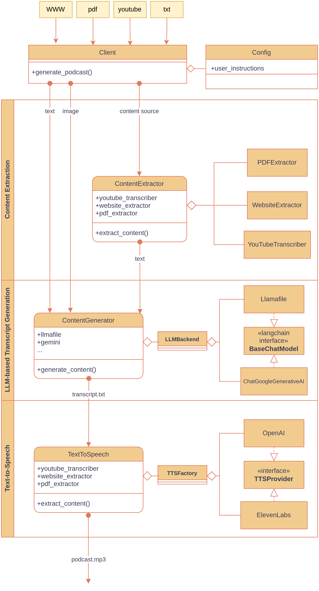

# Abstract

`Podcastfy` is an open-source Python framework that programmatically transforms multisourced, multimodal content into multilingual, natural-sounding audio conversations using generative AI. By converting various types of digital content - including images, websites, YouTube videos, and PDFs - into conversational audio formats, `Podcastfy` enhances accessibility, engagement, and usability for a wide range of users. As an open-source project, `Podcastfy` benefits from continuous community-driven improvements, enhancing its adaptability to evolving user requirements and accessibility standards.

# Statement of Need

The rapid expansion of digital content across various formats has intensified the need for tools capable of converting diverse information into accessible and digestible forms [@johnson2023adaptive; @chen2023digital; @mccune2023accessibility]. Existing solutions often fall short due to their proprietary nature, limited multimodal support, or inadequate accessibility features [@marcus2019design; @peterson2023web; @gupta2023advances].

`Podcastfy` addresses this gap with an open-source solution that supports multimodal input processing and generates natural-sounding, summarized conversational content. Leveraging advances in large language models (LLMs) and text-to-speech (TTS) synthesis, `Podcastfy` aims to benefit a diverse group of users — including content creators, educators, researchers, and accessibility advocates — by providing a customizable solution that transforms digital content into multilingual textual and auditory formats, enhancing accessibility and engagement.

# Features

- Generate conversational content from multiple sources and formats (images, websites, YouTube, and PDFs).
- Customize transcript and audio generation (e.g., style, language, structure, length).
- Create podcasts from pre-existing or edited transcripts.
- Leverage cloud-based and local LLMs for transcript generation (increased privacy and control).
- Integrate with advanced text-to-speech models (OpenAI, ElevenLabs, and Microsoft Edge).
- Provide multi-language support for global content creation and enhanced accessibility.
- Integrate seamlessly with CLI and Python packages for automated workflows.

See [audio samples](https://github.com/souzatharsis/podcastfy?tab=readme-ov-file#audio-examples-).

# Use Cases

`Podcastfy` is designed to serve a wide range of applications, including:

- **Content Creators** can use `Podcastfy` to convert blog posts, articles, or multimedia content into podcast-style audio, enabling them to reach broader audiences. By transforming content into an audio format, creators can cater to users who prefer listening over reading.

- **Educators** can transform lecture notes, presentations, and visual materials into audio conversations, making educational content more accessible to students with different learning preferences. This is particularly beneficial for students with visual impairments or those who have difficulty processing written information.

- **Researchers** can convert research papers, visual data, and technical content into conversational audio. This makes it easier for a wider audience, including those with disabilities, to consume and understand complex scientific information. Researchers can also create audio summaries of their work to enhance accessibility.

- **Accessibility Advocates** can use `Podcastfy` to promote digital accessibility by providing a tool that converts multimodal content into auditory formats. This helps individuals with visual impairments, dyslexia, or other disabilities that make it challenging to consume written or visual content.


# Implementation and Architecture

`Podcastfy` implements a modular architecture designed for flexibility and extensibility through five main components, as shown in Figure 1.


1. **Client Interface**
   - Provides both CLI (Command-Line Interface) and API interfaces.
   - Coordinates the workflow between processing layers.
   - Implements a unified interface for podcast generation through the `generate_podcast()` method.

2. **Configuration Management**
   - Offers extensive customization options through a dedicated module.
   - Manages system settings and user preferences, such as podcast name, language, style, and structure.
   - Controls the behavior of all processing layers.

3. **Content Extraction Layer**
   - Extracts content from various sources, including websites, PDFs, and YouTube videos.
   - The `ContentExtractor` class coordinates three specialized extractors:
     - `PDFExtractor`: Handles PDF document processing.
     - `WebsiteExtractor`: Manages website content extraction.
     - `YouTubeTranscriber`: Processes YouTube video content.
   - Serves as the entry point for all input types, providing standardized text output to the transcript generator.

4. **LLM-based Transcript Generation Layer**
   - Uses large language models to generate natural-sounding conversations from extracted content.
   - The `ContentGenerator` class manages conversation generation using different LLM backends:
     - Integrates with LangChain to implement prompt management and common LLM access through the `BaseChatModel` interface.
     - Supports both local (`LlamaFile`) and cloud-based models.
     - Uses `ChatGoogleGenerativeAI` for cloud-based LLM services.
   - Allows customization of conversation style, roles, and dialogue structure.
   - Outputs structured conversations in text format.

5. **Text-to-Speech (TTS) Layer**
   - Converts input transcripts into audio using various TTS models.
   - The `TextToSpeech` class implements a factory pattern:
     - The `TTSFactory` creates appropriate providers based on configuration.
     - Supports multiple backends (OpenAI, ElevenLabs, and Microsoft Edge) through the `TTSProvider` interface.
   - Produces the final podcast audio output.

{width=80%}

The modular architecture enables independent development and maintenance of each component. This pipeline design ensures a clean separation of concerns while maintaining seamless data transformation between stages. This modular approach also facilitates easy updates and extensions to individual components without affecting the rest of the system.

The framework is offered as a Python package, with a command-line interface as well as a REST API, making it accessible to users with different technical backgrounds and requirements.


# Quick Start

## Prerequisites
- Python 3.11 or higher
- `$ pip install ffmpeg` (for audio processing)

## Setup
1. Install from PyPI
  `$ pip install podcastfy`

2. Set up [API keys](usage/config.md)

## Python
```python
from podcastfy.client import generate_podcast

audio_file = generate_podcast(urls=["<url1>", "<url2>"])
```
## CLI
```
python -m podcastfy.client --url <url1> --url <url2>
```


# Customization Examples

`Podcastfy` offers various customization options that make it versatile for different types of content transformation. To accomplish that, we leverage LangChain's [@langchain2024] prompt management capabilities to dynamically construct prompts for the LLM, adjusting conversation characteristics such as style, roles, and dialogue structure. Below are some examples that demonstrate its capabilities.

## Academic Debate

The following Python code demonstrates how to configure `Podcastfy` for an academic debate:

```python
from podcastfy import generate_podcast

debate_config = {
    "conversation_style": ["formal", "debate"],
    "roles_person1": "main presenter",
    "roles_person2": "opposing viewpoint", 
    "dialogue_structure": ["Introduction", "Argument Presentation", "Counterarguments", "Conclusion"]
}

generate_podcast(
    urls=["PATH/TO/academic-article.pdf"],
    conversation_config=debate_config
)
```

In this example, the roles are set to "main presenter" and "opposing viewpoint" to simulate an academic debate between two speakers on a chosen topic. This approach is especially useful for educational content that aims to present multiple perspectives on a topic. The output is structured with clear sections such as introduction, argument presentation, counterarguments, and conclusion, allowing listeners to follow complex ideas easily.


## Technical Tutorial

In this example, the configuration is optimized for creating technical tutorial content. 

```python
tutorial_config = {
    "word_count": 2500,
    "conversation_style": ["instructional", "step-by-step"],
    "roles_person1": "expert developer",
    "roles_person2": "learning developer",
    "dialogue_structure": [
        "Concept Introduction",
        "Technical Background",
        "Implementation Steps",
        "Common Pitfalls",
        "Best Practices"
    ],
    "engagement_techniques": [
        "code examples",
        "real-world applications",
        "troubleshooting tips"
    ],
    "creativity": 0.4
}

generate_podcast(
    urls=["https://tech-blog.com/tutorial"],
    conversation_config=tutorial_config
)
```


The roles are set to "expert developer" and "learning developer" to create a natural teaching dynamic. The dialogue structure follows a logical progression from concept introduction through implementation and best practices. The engagement_techniques parameter ensures the content remains practical and applicable by incorporating code examples, real-world applications, and troubleshooting guidance. A moderate creativity setting (0.4) maintains technical accuracy while allowing for engaging explanations and examples.


## Storytelling Adventure

The following Python code demonstrates how to generate a storytelling podcast:

```python
from podcastfy import generate_podcast

story_config = {
    "conversation_style": ["adventurous", "narrative"],
    "creativity": 1.0,
    "roles_person1": "narrator", 
    "roles_person2": "character",
    "dialogue_structure": ["Introduction", "Adventure Begins", "Challenges", "Resolution"]
}

generate_podcast(
    urls=["SAMPLE/WWW.URL.COM"],
    conversation_config=story_config
)
```

In this example, `Podcastfy` creates an engaging story by assigning roles like "narrator" and "character" and adjusting the creativity parameter for richer descriptions. Using this configuration, `Podcastfy` can generate engaging narrative content. By adjusting the creativity parameter, `Podcastfy` can create a story involving multiple characters, unexpected plot twists, and rich descriptions.

## Additional Examples

### Daily News Briefing
```python
news_config = {
    "word_count": 1500,
    "conversation_style": ["concise", "informative"],
    "podcast_name": "Morning Briefing",
    "dialogue_structure": [
        "Headlines",
        "Key Stories",
        "Market Update",
        "Weather"
    ],
    "roles_person1": "news anchor",
    "roles_person2": "field reporter",
    "creativity": 0.3
}

generate_podcast(
    urls=[
        "https://news-source.com/headlines",
        "https://market-updates.com/today"
    ],
    conversation_config=news_config
)
```

### Language Learning Content
```python
language_config = {
    "output_language": "Spanish",
    "word_count": 1000,
    "conversation_style": ["educational", "casual"],
    "engagement_techniques": [
        "vocabulary explanations",
        "cultural context",
        "pronunciation tips"
    ],
    "roles_person1": "language teacher",
    "roles_person2": "curious student",
    "creativity": 0.6
}

generate_podcast(
    urls=["https://spanish-content.com/article"],
    conversation_config=language_config
)
```


## Working with Podcastfy Modules

`Podcastfy`'s components are designed to work independently, allowing flexibility in updating or extending each module. The data flows from the `ContentExtractor` module to `ContentGenerator` and finally to the `TexttoSpeech` converter, ensuring a seamless transformation of multimodal content into audio. In this section, we provide some examples of how to use each module.

## Content Extraction
Podcastfy's `content_extractor.py` module allows users to extract content from a given URL, which can be processed further to generate a podcast. Below is an example of how to use the content extraction component:

```python
from podcastfy.content_extractor import ContentExtractor

# Initialize the content extractor
extractor = ContentExtractor()

# Extract content from a URL
url = "https://example.com/article"
extracted_content = extractor.extract_content(url)

print("Extracted Content:")
print(extracted_content)
```

This example demonstrates how to extract text from a given URL. The extracted content is then passed to the next stages of processing.

## Content Generation

The `content_generator.py` module is responsible for generating conversational content based on textual input. Below is an example of how to use the content generation component:

```python
from podcastfy.content_generator import ContentGenerator

# Initialize the content generator
generator = ContentGenerator(api_key="<GEMINI_API_KEY>")

# Generate conversational content
input_text = "This is a sample input text about artificial intelligence."
generated_conversation = generator.generate_conversation(input_text)

print("Generated Conversation:")
print(generated_conversation)
```

 Users can opt to run a cloud-based LLM (Gemini) or run a local (potentially Open Source) LLM model ([see local llm configuration](https://github.com/souzatharsis/podcastfy/blob/main/usage/local_llm.md)).

## Text-to-Speech Conversion

The `text_to_speech.py` module allows the generated transcript to be converted into audio. Below is an example of how to use the text-to-speech component:

```python
from podcastfy.text_to_speech import TextToSpeech

# Initialize the text-to-speech converter
tts = TextToSpeech(model='elevenlabs', api_key="<ELEVENLABS_API_KEY>")

# Convert the generated conversation to speech
input_text = "<Person1>This is a sample conversation generated by Podcastfy.</Person1><Person2>That's great!</Person2>"
output_audio_file = "output_podcast.mp3"
tts.convert_to_speech(input_text, output_audio_file)

print(f"Audio saved to {output_audio_file}")
```

This example demonstrates how to use the `TextToSpeech` class to convert generated text into an audio file. Users can specify different models for TTS, such as `elevenlabs`, `openai`, or `edge` (free to use).


# Limitations

`Podcastfy` has several limitations, including:

- **Content Accuracy and Quality**
  - The accuracy of generated conversations depends heavily on the capabilities of the underlying LLMs.
  - Complex technical or domain-specific content may not always be accurately interpreted or summarized.
  - The framework cannot guarantee the factual correctness of generated content, requiring human verification for critical applications.

- **Language Support Constraints**
  - While multilingual support is available, performance may vary significantly across different languages.
  - Less common languages may have limited TTS voice options and lower-quality speech synthesis.
  - Nuanced cultural contexts and idioms may not translate effectively across languages.

- **Technical Dependencies**
  - Reliance on third-party APIs (OpenAI, ElevenLabs, Google) introduces potential service availability risks.
  - Local LLM options, while providing independence, require significant computational resources.
  - Network connectivity is required for cloud-based services, limiting offline usage.

- **Content Extraction Challenges**
  - Complex webpage layouts or dynamic content may not be accurately extracted.
  - PDF extraction quality depends on document formatting and structure.
  - YouTube video processing depends on the availability of transcripts.

- **Accessibility Considerations**
  - Generated audio may not fully meet all accessibility standards.
  - Limited support for real-time content processing.
  - May require additional processing for users with specific accessibility needs.

These limitations highlight areas for future development and improvement of the framework. Users should carefully consider these constraints when implementing `Podcastfy` for their specific use cases and requirements.

# Limitations

`Podcastfy` faces several key limitations in its current implementation. The accuracy and quality of generated content heavily depends on the underlying LLMs, with complex technical content potentially being misinterpreted. Additionally, while multilingual support is available, performance varies across languages, with less common languages having limited TTS voice options. The framework also relies on third-party APIs which introduces service availability risks, and local LLM options require significant computational resources.

These limitations highlight areas for future development and improvement of the framework. Users should carefully consider these constraints when implementing `Podcastfy` for their specific use cases and requirements.


# Conclusion

`Podcastfy` contributes to multimodal content accessibility by enabling the programmatic transformation of digital content into conversational audio. The framework addresses accessibility needs through automated content summarization and natural-sounding speech synthesis. Its modular design and configurable options allow for flexible content processing and audio generation workflows that can be adapted for different use cases and requirements.

We invite contributions from the community to further enhance the capabilities of `Podcastfy`. Whether it's by adding support for new input modalities, improving the quality of conversation generation, or optimizing the TTS synthesis, we welcome collaboration to make `Podcastfy` more powerful and versatile.


# Acknowledgements

We acknowledge the open-source community and the developers of the various libraries and tools that make `Podcastfy` possible. Special thanks to the developers of LangChain, Llamafile and HuggingFace. We are particularly grateful to all our [contributors](https://github.com/souzatharsis/podcastfy/graphs/contributors) who have helped improve this project.


# References
