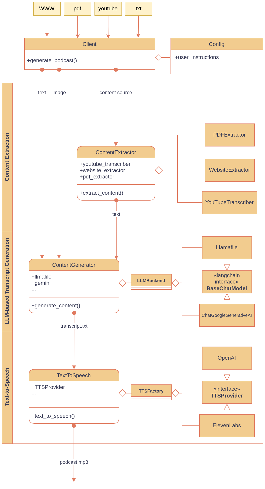

# Abstract

Podcastfy is an open-source Python framework that enables programmatic summarization of multisourced multimodal content into multilingual natural-sounding conversational text and audio using generative AI. It provides an end-to-end modular and extensible pipeline that builds on modern LLMs and text-to-speech models to deliver a customizable framework.

## 1. Statement of Need

The rapid growth of digital content across various formats has created an urgent need for tools that can transform written and visual information from myriad of sources into accessible and digestible formats [@chen2020making]. Existing solutions often fall short due to their proprietary nature, lack of comprehensive multimodal support, or limited accessibility features, as highlighted in recent reviews on digital accessibility tools (Smith et al., 2020).


<!-- According to the World Health Organization (WHO), over 2.2 billion people globally have some form of visual impairment, and many could benefit from auditory content formats as an alternative to written text (World Health Organization, 2021). Additionally, studies have shown that audio-based content can improve information retention for auditory learners and make content more accessible to individuals with dyslexia (Sharma et al., 2019). -->

Podcastfy addresses this gap by providing an open-source solution that supports multimodal input processing and generates natural-sounding summarized textual and audio content. Leveraging advances in large language models (LLMs) and text-to-speech (TTS) synthesis, Podcastfy aims to benefit a diverse group of users, including content creators, educators, researchers, and accessibility advocates, by providing an effective solution to transform digital content into multilingual textual and auditory formats that enhance accessibility and engagement.

## 2. Implementation and Architecture

Podcastfy implements a modular architecture designed for flexibility and extensibility through 5 main components:



1. **Client Interface**
   - Provides both CLI and API interfaces
   - Implements the main `generate_podcast()` method
   - Coordinates workflow between processing layers

2. **Configuration Management**
   - Provides extensive customization options through a dedicated module
   - Manages system settings and user preferences
   - Controls behavior of all processing layers

3. **Content Extraction Layer**
   - Responsible for extracting content from various sources (websites, PDFs, YouTube videos)
   - The `ContentExtractor` coordinates three specialized extractors:
     - `PDFExtractor`: Handles PDF document processing
     - `WebsiteExtractor`: Manages website content extraction
     - `YouTubeTranscriber`: Processes YouTube video content
   - Serves as the entry point for all input types, providing standardized text output to the content generator

4. **LLM-based Transcript Generation Layer**
   - Uses large language models to generate natural-sounding conversations from extracted content
   - The `ContentGenerator` class manages conversation generation using different LLM backends:
     - Integrates with LangChain to implement prompt management and common LLM access through `BaseChatModel` interface
     - Supports both local (`Llamafile`) and cloud-based models
     - Uses `ChatGoogleGenerativeAI` for cloud-based LLM services
   - Allows customization of conversation style, roles, and dialogue structure
   - Outputs structured conversations in text format

5. **Text-to-Speech (TTS) Layer**
   - Converts input transcript into audio using various TTS models
   - The `TextToSpeech` class implements a factory pattern:
     - `TTSFactory` creates appropriate providers based on configuration
     - Supports multiple backends (OpenAI, ElevenLabs) through `TTSProvider` interface
   - Produces the final podcast audio output


The components are designed to work independently, allowing flexibility in updating or extending each module. The data flows from the Content Extractor to the Content Generator and finally to the TTS Converter, ensuring a seamless transformation of multimodal content into audio.

The framework is offered as a Python Package, with a command-line interface as well as a REST API making it accessible to users with different technical backgrounds and requirements.

## 4.1 Code Examples: Utilizing Podcastfy

### 4.1.0 Installation

To use Podcastfy, you need to install it via pip:

```bash
pip install podcastfy
```

Alternatively, you can run it via Docker:

```bash
docker pull podcastfy/podcastfy:latest
docker run -p 8080:8080 podcastfy/podcastfy:latest
```

You can also try it interactively using Google Colab:


### 4.1.1 Content Extraction

Podcastfy's `content_extractor.py` module allows users to extract content from a given URL, which can be processed further to generate a podcast. Below is an example of how to use the content extraction component:

```python
from podcastfy.content_extractor import ContentExtractor

# Initialize the content extractor
extractor = ContentExtractor()

# Extract content from a URL
url = "https://example.com/article"
extracted_content = extractor.extract_content(url)

print("Extracted Content:")
print(extracted_content)
```

This example demonstrates how to extract text from a given URL. The extracted content is then passed to the next stages of processing.

### 4.1.2 Content Generation

The `content_generator.py` module is responsible for generating conversational content based on the extracted input. Below is an example of how to use the content generation component:

```python
from podcastfy.content_generator import ContentGenerator

# Initialize the content generator
generator = ContentGenerator()

# Generate conversational content
input_text = "This is a sample input text about artificial intelligence."
generated_conversation = generator.generate_conversation(input_text)

print("Generated Conversation:")
print(generated_conversation)
```

In this example, the `ContentGenerator` class is used to create a conversation based on an input text. This generated conversation can be customized by setting different parameters, such as conversation style and roles.

### 4.1.3 Text-to-Speech Conversion

The `text_to_speech.py` module allows the generated text to be converted into audio. Below is an example of how to use the text-to-speech component:

```python
from podcastfy.text_to_speech import TextToSpeech

# Initialize the text-to-speech converter
tts = TextToSpeech(model='elevenlabs')

# Convert the generated conversation to speech
input_text = "This is a sample conversation generated by Podcastfy."
output_audio_file = "output_podcast.mp3"
tts.convert_to_speech(input_text, output_audio_file)

print(f"Audio saved to {output_audio_file}")
```

This example demonstrates how to use the `TextToSpeech` class to convert generated text into an audio file. Users can specify different models for TTS, such as `elevenlabs`, `openai`, or `edge`.

### 4.1.4 Full Pipeline Example

To demonstrate the complete usage of Podcastfy, here is an example that combines content extraction, content generation, and text-to-speech conversion, including multilingual capabilities:

```python
from podcastfy.content_extractor import ContentExtractor
from podcastfy.content_generator import ContentGenerator
from podcastfy.text_to_speech import TextToSpeech

# Step 1: Extract content from a URL
extractor = ContentExtractor()
url = "https://example.com/article"
extracted_content = extractor.extract_content(url)

# Step 2: Generate conversational content based on the extracted content
generator = ContentGenerator()
generated_conversation = generator.generate_conversation(extracted_content)

# Step 3: Convert the generated conversation into an audio podcast
tts = TextToSpeech(model='elevenlabs')
output_audio_file = "output_podcast.mp3"
tts.convert_to_speech(generated_conversation, output_audio_file)

print(f"Podcast saved to {output_audio_file}")
```

In this full pipeline example, Podcastfy processes content from a webpage and produces an audio podcast. This process can also be customized to generate multilingual audio content by specifying the `output_language` parameter, for example, using `"Spanish"` or `"French"`.

To demonstrate the complete usage of Podcastfy, here is an example that combines content extraction, content generation, and text-to-speech conversion:

```python
from podcastfy.content_extractor import ContentExtractor
from podcastfy.content_generator import ContentGenerator
from podcastfy.text_to_speech import TextToSpeech

# Step 1: Extract content from a URL
extractor = ContentExtractor()
url = "https://example.com/article"
extracted_content = extractor.extract_content(url)

# Step 2: Generate conversational content based on the extracted content
generator = ContentGenerator()
generated_conversation = generator.generate_conversation(extracted_content)

# Step 3: Convert the generated conversation into an audio podcast
tts = TextToSpeech(model='elevenlabs')
output_audio_file = "output_podcast.mp3"
tts.convert_to_speech(generated_conversation, output_audio_file)

print(f"Podcast saved to {output_audio_file}")
```

This full pipeline example shows how Podcastfy can be used end-to-end to transform content from a web page into an audio podcast. Each step uses different modules of Podcastfy, providing a complete solution for multimodal content transformation.

## 4.1 Code Example: Utilizing Podcastfy

The following Python code snippet demonstrates how to use Podcastfy to generate an audio conversation from a given text input:

```python
from podcastfy import generate_podcast

# Example URL to extract content from
target_url = "https://example.com/article"

# Generate a podcast with default settings
generate_podcast(
    urls=[target_url],
    conversation_style=["informative", "engaging"],
    output_language="English",
    creativity=0.7,
    roles_person1="main presenter",
    roles_person2="clarifier"
)
```

In this example, Podcastfy takes a URL as input, processes the content, and generates an audio conversation in English. The conversation style is set to "informative" and "engaging," and the creativity level is set to 0.7. The roles for the two speakers are defined as "main presenter" and "clarifier," respectively.

Podcastfy is implemented in Python and leverages popular machine learning libraries, including PyTorch and TensorFlow, for content analysis and generation. The framework follows a modular architecture, with distinct components for input processing, conversation generation, and text-to-speech synthesis. This architecture ensures that each component can be developed, tested, and improved independently, promoting flexibility and easier maintenance.

The core pipeline of Podcastfy consists of the following stages:


## 6. Use Cases

Podcastfy's versatility allows it to be used in various real-world scenarios. Here are some updated and additional use cases for the framework:

- **Multilingual Podcasts**: Users can generate podcasts in multiple languages, making the content accessible to a global audience. By setting the `output_language` parameter, users can create conversations in languages such as Spanish, French, or German.

- **YouTube Video Conversion**: Podcastfy can be used to convert YouTube videos into audio podcasts. By providing a YouTube link as input, the content extractor processes the video, transcribes it, and generates an audio version that can be listened to on the go.

- **News Summarization**: Podcastfy can summarize long news articles into concise audio formats, providing personalized audio news briefings compiled from the user's preferred sources.

- **Educational Content Creation**: Educators can create audio versions of their course materials, catering to students with different learning preferences and enhancing learning accessibility.

- **Book and Podcast Summaries**: Users can generate audio summaries of books or podcasts, allowing them to get an overview of the material before deciding to explore the full content.

- **Personal Branding**: Job seekers can use Podcastfy to create unique audio-based personal presentations from their CV or LinkedIn profile, providing a memorable way to showcase their skills and experience to potential employers.

- **Conference and Event Recaps**: Professionals who miss industry events can stay updated by listening to audio recaps generated by Podcastfy, which summarize key highlights and takeaways.

## 6.1 Interesting Examples

Podcastfy offers various customization options that make it versatile for different types of content transformation. Below are some interesting examples that demonstrate its capability:

### 6.1.1 Academic Debate

The following Python code demonstrates how to configure Podcastfy for an academic debate:

```python
from podcastfy import generate_podcast

# Example: Generate an academic debate podcast
generate_podcast(
    urls=["https://example.com/academic-article"],
    conversation_style=["formal", "debate"],
    roles_person1="main presenter",
    roles_person2="opposing viewpoint",
    dialogue_structure=["Introduction", "Argument Presentation", "Counterarguments", "Conclusion"],
    output_language="English"
)
```

In this example, the roles are set to "main presenter" and "opposing viewpoint," simulating a debate between two individuals.

Podcastfy can be configured to simulate an academic debate between two speakers on a chosen topic. For instance, by setting the conversation roles as "main presenter" and "opposing viewpoint," Podcastfy can generate a balanced discussion. This approach is especially useful for educational content that aims to present multiple perspectives on a topic. The output is structured with clear sections such as introduction, argument presentation, counterarguments, and conclusion, allowing listeners to follow complex ideas easily.

### 6.1.2 Storytelling Adventure

The following Python code demonstrates how to generate a storytelling podcast:

```python
from podcastfy import generate_podcast

# Example: Generate a storytelling adventure podcast
generate_podcast(
    urls=[],
    conversation_style=["adventurous", "narrative"],
    creativity=1.0,
    roles_person1="narrator",
    roles_person2="character",
    dialogue_structure=["Introduction", "Adventure Begins", "Challenges", "Resolution"],
    output_language="English"
)
```

Here, Podcastfy creates an engaging story by assigning roles like "narrator" and "character" and adjusting the creativity parameter for richer descriptions.

Using the "Storytelling Adventure" configuration, Podcastfy can generate engaging narrative content. By adjusting the creativity parameter, Podcastfy can create a story involving multiple characters, unexpected plot twists, and rich descriptions. This setup is ideal for generating podcasts that entertain children or even creative audio content that supports language learning.


### 2. Daily News Briefing
```python
news_config = {
    "word_count": 1500,
    "conversation_style": ["concise", "informative"],
    "podcast_name": "Morning Briefing",
    "dialogue_structure": [
        "Headlines",
        "Key Stories",
        "Market Update",
        "Weather"
    ],
    "roles_person1": "news anchor",
    "roles_person2": "field reporter",
    "creativity": 0.3
}

generate_podcast(
    urls=[
        "https://news-source.com/headlines",
        "https://market-updates.com/today"
    ],
    conversation_config=news_config
)
```

### 3. Language Learning Content
```python
language_config = {
    "output_language": "Spanish",
    "word_count": 1000,
    "conversation_style": ["educational", "casual"],
    "engagement_techniques": [
        "vocabulary explanations",
        "cultural context",
        "pronunciation tips"
    ],
    "roles_person1": "language teacher",
    "roles_person2": "curious student",
    "creativity": 0.6
}

generate_podcast(
    urls=["https://spanish-content.com/article"],
    conversation_config=language_config
)
```

### 4. Technical Tutorial
```python
tutorial_config = {
    "word_count": 2500,
    "conversation_style": ["instructional", "step-by-step"],
    "roles_person1": "expert developer",
    "roles_person2": "learning developer",
    "dialogue_structure": [
        "Concept Introduction",
        "Technical Background",
        "Implementation Steps",
        "Common Pitfalls",
        "Best Practices"
    ],
    "engagement_techniques": [
        "code examples",
        "real-world applications",
        "troubleshooting tips"
    ],
    "creativity": 0.4
}

generate_podcast(
    urls=["https://tech-blog.com/tutorial"],
    conversation_config=tutorial_config
)
```

### 6.1.3 Local LLM Utilization

The following Python code demonstrates how to use a local LLM with Podcastfy:

```python
from podcastfy import generate_podcast

# Example: Generate a podcast using a local LLM
generate_podcast(
    urls=["https://internal.example.com/research-report"],
    is_local=True,  # Use a local LLM for privacy concerns
    conversation_style=["informative"],
    roles_person1="main presenter",
    roles_person2="clarifier",
    output_language="English"
)
```

Using the `is_local=True` parameter, Podcastfy utilizes a local LLM, making it ideal for scenarios where data privacy is a priority.

Podcastfy also allows users to employ local language models (LLMs) to generate content. This feature is valuable for users who prioritize data privacy or have specific computational limitations. For example, an organization could use a local LLM to generate a podcast transcript based on an internal research report without needing to send sensitive data to third-party servers. While local models may have lower performance compared to cloud-based large LLMs, they provide a feasible alternative for privacy-centric use cases.

### 6.1.4 How-To Example: Setting Up Local LLM

The following Python code demonstrates how to generate a podcast based on a technical how-to document, such as setting up a local LLM:

```python
from podcastfy import generate_podcast

# Example: Generate a podcast on setting up a local LLM
generate_podcast(
    urls=[],
    conversation_style=["step-by-step", "informative"],
    roles_person1="instructor",
    roles_person2="learner",
    dialogue_structure=["Introduction", "Installation Steps", "Configuration", "Troubleshooting"],
    output_language="English"
)
```

This example demonstrates how Podcastfy can generate a detailed and structured podcast to guide listeners through setting up a local LLM, using roles such as "instructor" and "learner."
## 5. Implementation and Availability

Podcastfy is distributed under an open-source license (MIT License) to ensure that it is freely available to the community. The source code, along with detailed documentation, installation instructions, and usage examples, can be found in our GitHub repository: [GitHub Repository Link]. The repository includes comprehensive guidelines on how to set up the framework, as well as a collection of tutorials to help users get started with transforming multimodal content into audio conversations.

Podcastfy's documentation covers various aspects of the framework, including the installation process, system requirements, and detailed explanations of each module. Users are encouraged to contribute to the project by reporting issues, suggesting new features, or submitting pull requests to enhance the functionality of the framework.

### 6.1.5 Audio Example Links

Podcastfy allows users to generate audio examples in multiple formats. Here are some sample links to generated audio content for different use cases:

- [Academic Debate Podcast Example](https://podcastfy.readthedocs.io/en/latest/audio/academic_debate.mp3)
- [Storytelling Adventure Podcast Example](https://podcastfy.readthedocs.io/en/latest/audio/storytelling_adventure.mp3)
- [Local LLM How-To Podcast Example](https://podcastfy.readthedocs.io/en/latest/audio/local_llm_how_to.mp3)
- [Multilingual Example: French Conversation](https://podcastfy.readthedocs.io/en/latest/audio/multilingual_french.mp3)
- [YouTube Video Conversion Example](https://podcastfy.readthedocs.io/en/latest/audio/youtube_video_conversion.mp3)
- [News Summary Example](https://podcastfy.readthedocs.io/en/latest/audio/news_summary.mp3)

These examples demonstrate the diversity of content that can be produced using Podcastfy, providing real audio outputs that showcase different conversational styles, languages, and topics.

Podcastfy allows users to generate audio examples in multiple formats. Here are some sample links to generated audio content for different use cases:

- [Academic Debate Podcast Example](https://example.com/audio/academic_debate.mp3)
- [Storytelling Adventure Podcast Example](https://example.com/audio/storytelling_adventure.mp3)
- [Local LLM How-To Podcast Example](https://example.com/audio/local_llm_how_to.mp3)

These examples demonstrate the diversity of content that can be produced using Podcastfy, providing real audio outputs that showcase different conversational styles and topics.

The following Python code demonstrates how to generate a podcast based on a technical how-to document, such as setting up a local LLM:

```python
from podcastfy import generate_podcast

# Example: Generate a podcast on setting up a local LLM
generate_podcast(
    urls=[],
    conversation_style=["step-by-step", "informative"],
    roles_person1="instructor",
    roles_person2="learner",
    dialogue_structure=["Introduction", "Installation Steps", "Configuration", "Troubleshooting"],
    output_language="English"
)
```

This example demonstrates how Podcastfy can generate a detailed and structured podcast to guide listeners through setting up a local LLM, using roles such as "instructor" and "learner."

By utilizing content from instructional documents, Podcastfy can generate a technical "how-to" podcast. For example, it could take a detailed tutorial on setting up an open-source software package and convert it into a conversation where one speaker explains each step while the other asks clarifying questions. This conversational format helps to break down complex instructions into a more accessible auditory experience.


Another interesting use case is the real-time generation of podcast content from live feeds or frequently updated content sources, such as blogs or news websites. Podcastfy can be configured to periodically scrape content from a website and convert it into an audio conversation. This setup is beneficial for creating summary podcasts of daily news or updates from a specific domain, such as technology or finance.

Podcastfy is designed to serve a wide range of applications, including:

- **Content Creators**: Content creators can use Podcastfy to convert blog posts, articles, or multimedia content into podcast-style audio, enabling them to reach broader audiences. By transforming content into audio format, creators can cater to users who prefer listening over reading.

- **Educators**: Educators can use Podcastfy to transform lecture notes, presentations, and visual materials into audio conversations, making educational content more accessible to students with different learning preferences. This can be particularly beneficial for students with visual impairments or those who have difficulty processing written information.

- **Researchers**: Researchers can use Podcastfy to convert research papers, visual data, and technical content into conversational audio. This makes it easier for a wider audience, including those with disabilities, to consume and understand complex scientific information. Researchers can also create audio summaries of their work, making their research more accessible.

- **Accessibility Advocates**: Podcastfy promotes digital accessibility by providing a tool that can convert multimodal content into auditory formats. This can help individuals with visual impairments, dyslexia, or other disabilities that make it challenging to consume written or visual content.

- **Media Organizations**: Media organizations can use Podcastfy to convert news articles, reports, and multimedia content into audio format, offering audio versions of their content to users who prefer listening, thereby increasing user engagement and reach.


# Community and Development

Podcastfy is actively maintained and welcomes community contributions. The project follows best practices for open-source development:
- Comprehensive documentation
- Clear contribution guidelines
- Automated testing
- Continuous integration
- Version control
- Issue tracking

The framework is distributed under the Apache 2.0 license, ensuring it remains freely available while protecting both users and contributors.

# Future Directions

Planned developments include:
- Enhanced multilingual support
- Additional TTS engine integrations
- Improved conversation generation
- Extended customization options
- Advanced audio processing features

## 8. Conclusion

Podcastfy represents a useful contribution to the open-source community by providing an approach to multimodal content accessibility. By enabling the transformation of various types of digital content into conversational audio, Podcastfy improves accessibility, engagement, and usability for a wide range of users. The open-source nature of the project ensures that it can be continuously improved and adapted to meet the evolving needs of its users.

We invite contributions from the community to further enhance the capabilities of Podcastfy. Whether it is by adding support for new input modalities, improving the quality of conversation generation, or optimizing the TTS synthesis, we welcome collaboration to make Podcastfy more powerful and versatile.

# Acknowledgements

We acknowledge the open-source community and the developers of the various libraries and tools that make Podcastfy possible. Special thanks to the developers of LangChain, OpenAI, ElevenLabs, and Microsoft Edge TTS for their excellent tools and documentation.

# References
